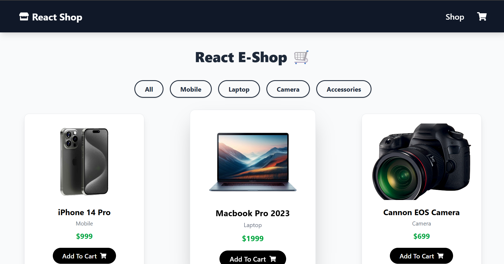
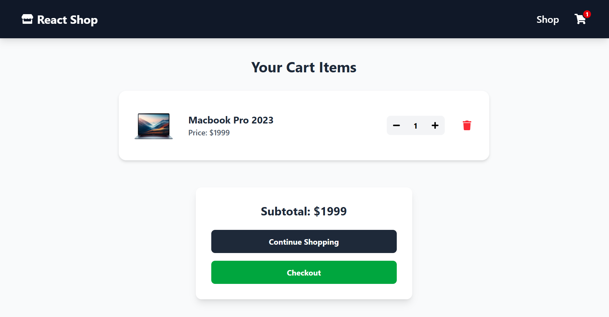

# 🛍️ React E-Commerce Shop

A fully functional, responsive E-commerce application built with **React.js** and **Tailwind CSS**. It features a dynamic cart system, product filtering, and a modern UI.

🔗 **Live Demo:** [PASTE_YOUR_NETLIFY_LINK_HERE]

---

## ✨ Features

- **🛒 Smart Cart System:** Add items, remove items, and delete entire products from the cart.
- **🔢 Real-time Calculations:** Automatic subtotal calculation and cart badge updates.
- **🔍 Category Filtering:** Filter products by Mobile, Laptop, Camera, etc.
- **📱 Fully Responsive:** Works perfectly on Mobile, Tablet, and Desktop (built with Tailwind).
- **⚡ Fast Performance:** Optimized using Vite and Local Assets.

---

## 🛠️ Tech Stack

- **Frontend:** React.js (Vite)
- **Styling:** Tailwind CSS
- **State Management:** React Context API
- **Routing:** React Router DOM
- **Icons:** React Icons

---

## 📸 Screenshots

| Shop Page | Cart Page |
|-----------|-----------|
| |  |

*(Note: Replace these placeholder links with your actual screenshots)*

---

## 🚀 How to Run Locally

1. **Clone the repository:**
   ```bash
   git clone [https://github.com/your-username/react-ecommerce-shop.git](https://github.com/your-username/react-ecommerce-shop.git)